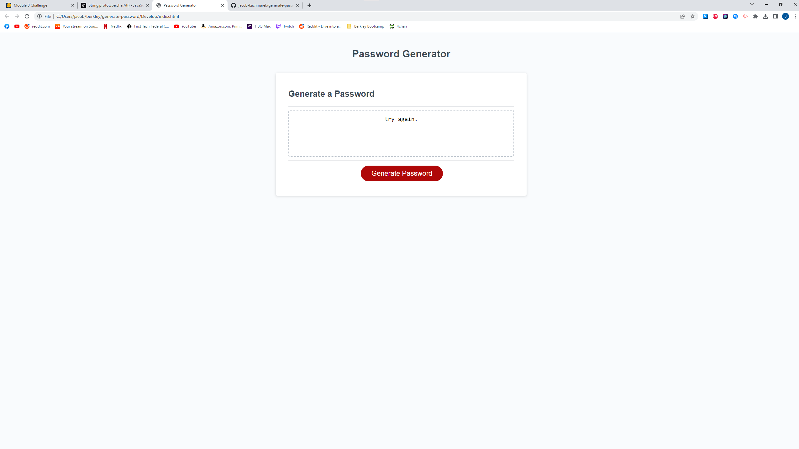

# generate-password

## Technology Used 
N/A
  
## Description 
This is a password generator. It randomly generates a password based on the users desired length and what characters they would like to include. You can use the generator [here.]()  Here is a picture of the deployed website. 

## Installation
N/A 

## Usage 
This site is very simple to navigate. Use the navigation bar in the top right on a desktop or laptop and just right at the top on a smartphone. Clicking the links will direct you to the associated section of the webpage. 

## Learning Points 
N/A

## Author Info
Jacob Kachmarek
 [Github](https://github.com/jacob-kachmarek)
 [Portfolio](https://jacob-kachmarek.github.io/jacob-kachmarek-portfolio/)
 [Linkedin](https://www.linkedin.com/in/jacob-kachmarek/)

## Credits
N/A

## License
N/A

## Badges
N/A

## Features
N/A

## Contributing
N/A

## Tests
N/A